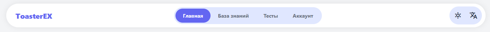
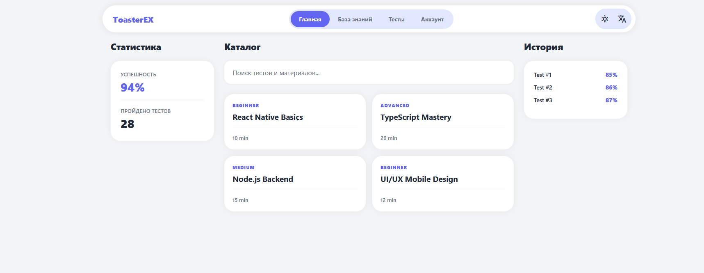

# Аккаунт и Роли

## Как начать работу

Мы ценим ваше время, поэтому в ToasterEX нет долгой регистрации с подтверждением почты. Авторизация происходит мгновенно через провайдеров:
* Google
* Яндекс
* VK

> Список провайдеров может меняться. Список актуальных провайдеров будут публиковаться также здесь.

При первом входе система автоматически создаст ваш профиль, сохранив все настройки и будущий прогресс обучения.

## Интерфейс платформы

Сверху располагается навигационная панель, с помощью которой можно переключаться по разделам платформы:
* [Главная страница](#Главная-страница) 
* [Базы знаний](knowledge_base.md)
* [Тесты](tests.md)
* Аккаунт

Также вы можете поменять язык вывода (Русский/English) и тему (светлая/темная).

### Главная страница

На главной странице сосредоточена ваша личная аналитика: виджет статистики показывает общую успешность прохождения материалов, а блок истории позволяет быстро вернуться к тесту, который вы не успели закончить, или проанализировать ошибки в прошлых попытках. Центральную часть занимает глобальный поиск — ваш навигатор по всем публичным материалам платформы.

## Роли и уровни доступа

В ToasterEX реализована гибкая система прав, которая позволяет разграничить возможности обычных слушателей, профессиональных контент-мейкеров и команды управления платформой. Ваша роль определяет не только доступные инструменты, но и степень влияния на общую базу знаний.

### Пользователь

Это стандартная роль, которую получает каждый после первой авторизации. Она идеально подходит для самостоятельного обучения и систематизации своих знаний. Пользователю доступен базовый набор функций: 
* Создание собственных учебных материалов:
    * Тесты
    * Базы знаний (только 1 базу знаний)
* Поиск по публичному каталогу и прохождение тестов в различных режимах
* Отслеживание прогресса через систему статистики и сохранение интересных баз знаний других авторов в свою библиотеку.

### Пользователь с подпиской **Pro**

Подписка Pro превращает платформу в мощный интеллектуальный комбайн. Эта роль создана для тех, кто хочет максимально автоматизировать процесс обучения и работать с большими объемами данных без ограничений.

Владельцы Pro-аккаунта имеют помимо базового следующий функционал:
* Возможность создавать неограниченное количество баз знаний
* Генерация банка вопросов с помощью ИИ на основе документов и картинок
* Генерация банка вопросов с помощью ИИ на основе базы знаний
* Функция проверки развернутого ответа в тесте с помощью ИИ

### Модератор

Модераторы — это хранители качества контента в ToasterEX. Их главная задача заключается в поддержании порядка и актуальности публичных материалов. Модераторы имеют доступ к специальной панели, куда попадают жалобы пользователей на ошибки в тестах или некорректное наполнение баз знаний.

В полномочия модератора входит право временной или постоянной блокировки ресурсов, которые нарушают правила платформы. Они выступают арбитрами в спорных ситуациях и могут выносить предупреждения пользователям, чья активность мешает нормальной работе сообщества. Благодаря их работе, в общем каталоге остаются только проверенные и полезные материалы.

### Администратор

Администратор обладает полным доступом ко всем техническим и управленческим аспектам платформы. Эта роль предполагает управление глобальной инфраструктурой: от изменения структуры базы данных до назначения новых модераторов.

Администраторы не только следят за работоспособностью системы, но и формируют юридический фундамент платформы, управляя нормативными документами и правилами пользования. Кроме того, им доступен модуль глубокой аналитики, который позволяет отслеживать общую активность пользователей и выявлять векторы развития проекта.