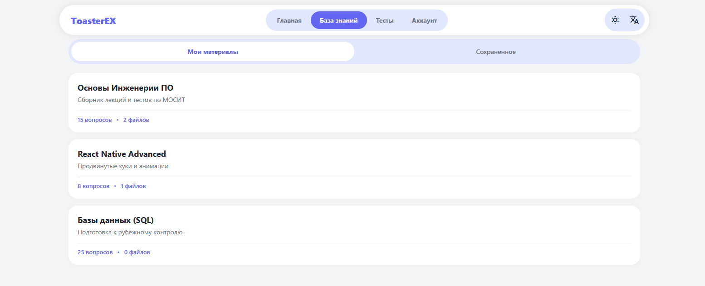

# Работа с Базами знаний

База знаний (БЗ) в ToasterEX — это ваш персональный или коллективный цифровой учебник. В отличие от обычных папок с файлами, БЗ структурирует информацию таким образом, чтобы она была готова к моментальному превращению в интерактивные тесты. Каждая база посвящена конкретной теме и может содержать в себе как текстовые модули, так и прикрепленные учебные материалы.

## Процесс изучения материалов

Изучение начинается с раздела «База знаний», где контент разделен на две логические части. Вкладка «Мои материалы» содержит всё, что создали вы лично, а «Сохраненное» — это ваша личная библиотека из публичных баз других авторов. Чтобы начать изучение, достаточно выбрать карточку базы из списка. 

Внутри вы увидите структурированный контент: лекции, статьи и прикрепленные файлы (например, PDF-презентации или схемы). Наличие строки поиска позволяет мгновенно перемещаться между темами, не перелистывая весь список вручную.

## Создание новой Базы знаний

Процесс создания интуитивно понятен: нажмите на иконку «+» в нижней части экрана. 

На первом этапе вы задаете название и краткое описание вашей базы. Это описание критически важно, так как именно по нему другие пользователи смогут найти ваш материал в глобальном каталоге. 

После создания оболочки вы переходите в редактор, где можете наполнять базу знаниями. Система поддерживает форматированный текст и загрузку дополнительных файлов, которые станут источником данных для будущего обучения и генерации тестов. 

## Редактирование и актуализация

Знания имеют свойство устаревать, поэтому в ToasterEX редактирование своих баз доступно в любое время. Владелец базы может изменять структуру разделов, дополнять текст новыми тезисами или заменять устаревшие файлы. 

Каждое сохранение изменений автоматически обновляет информацию для всех пользователей, которые добавили вашу базу в «Сохраненное». Это гарантирует, что ваше учебное сообщество всегда работает с самой свежей версией материала.

Весь контент состоит из отдельных блоков: абзацев, заголовков, списков или изображений.

Чтобы добавить новый элемент, просто нажмите на иконку + рядом с пустой строкой или введите символ /. Выберите нужный тип блока: текст, заголовок, маркированный список или чек-лист.

Каждый блок автономен. Вы можете легко менять их местами, просто перетаскивая их за маркеры. Это позволяет на ходу пересобирать структуру лекции, если логика повествования изменилась.

## Предложение правок и улучшений

Мы верим в силу совместного обучения, поэтому в платформу встроена система краудсорсинга знаний. Если вы изучаете чужую базу и нашли в ней ошибку, опечатку или хотите дополнить её важным фактом, вы можете воспользоваться функцией «Предложить изменения».

Процесс выглядит так: вы выделяете нужный фрагмент или описываете дополнение в специальной форме и отправляете его автору. Владелец базы получит уведомление и сможет увидеть ваше предложение в режиме «сравнения». Если правка действительно полезна, автор принимает её одним кликом, и она мгновенно становится частью основной базы. Это позволяет создавать максимально качественные и выверенные учебные пособия силами всего сообщества.